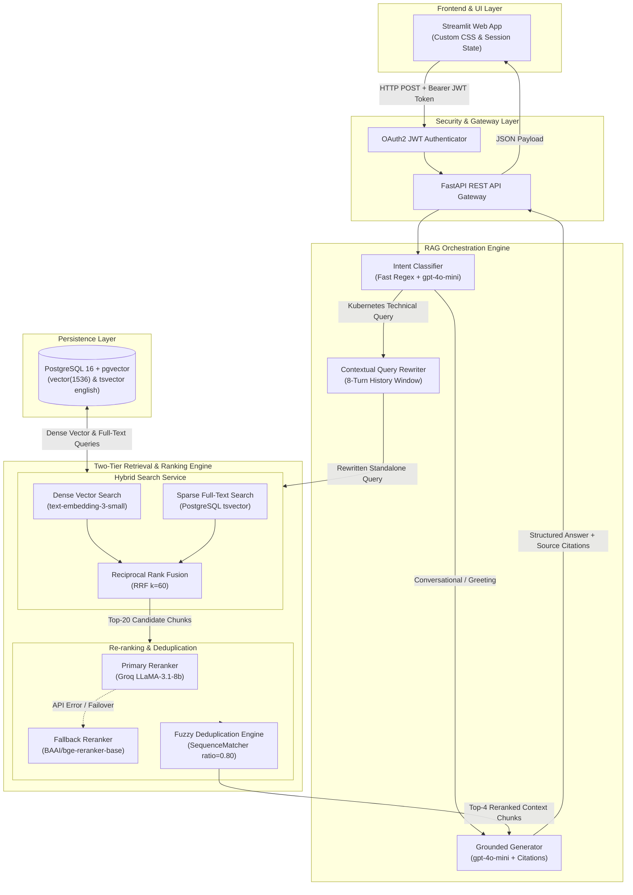
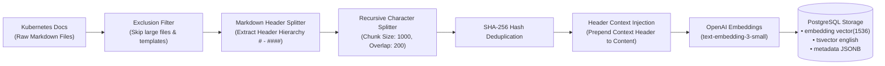
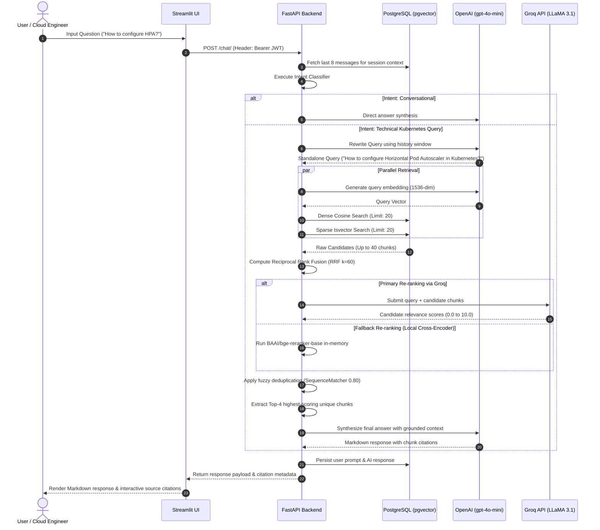

# ☸️ Enterprise Kubernetes RAG Assistant

<p align="center">
  <a href="https://fastapi.tiangolo.com"></a>
  <a href="https://www.python.org"></a>
  <a href="https://www.postgresql.org"></a>
  <a href="https://github.com/pgvector/pgvector"></a>
  <a href="https://openai.com"></a>
  <a href="https://groq.com"></a>
  <a href="https://www.langchain.com"></a>
  <a href="https://streamlit.io"></a>
  <a href="https://www.docker.com"></a>
  <a href="https://github.com/explodinggradients/ragas"></a>
  <a href="LICENSE"></a>
</p>

> **An enterprise-grade, high-performance Retrieval-Augmented Generation (RAG) system engineered specifically for complex technical documentation querying.** 
> Built with a multi-stage retrieval architecture featuring **Dense Semantic Vector Search + Sparse PostgreSQL BM25 Full-Text Search**, **Reciprocal Rank Fusion (RRF)**, **Groq LLaMA-3.1 Sub-Second Re-ranking** with **Local Cross-Encoder Fallback**, **Fuzzy Content Deduplication**, **Intent Classification Routing**, **Multi-Turn Contextual Query Rewriting**, **OAuth2 JWT Authentication**, and **Empirical RAGAS Benchmark Evaluation**.

---

## 📌 Table of Contents
- [Executive Summary & Engineering Motivation](#-executive-summary--engineering-motivation)
- [Key Features & Technical Innovations](#-key-features--technical-innovations)
- [System Architecture](#-system-architecture)
  - [1. High-Level Architecture](#1-high-level-architecture)
  - [2. Document Ingestion & Indexing Pipeline](#2-document-ingestion--indexing-pipeline)
  - [3. End-to-End Execution Flow](#3-end-to-end-execution-flow)
- [Deep-Dive: Engineering Highlights](#-deep-dive-engineering-highlights)
  - [Multi-Stage Retrieval & Reciprocal Rank Fusion (RRF)](#multi-stage-retrieval--reciprocal-rank-fusion-rrf)
  - [Two-Tier Re-ranking & Deduplication Engine](#two-tier-re-ranking--deduplication-engine)
  - [Intent Routing & Contextual Query Rewriting](#intent-routing--contextual-query-rewriting)
- [Empirical Evaluation & Benchmarks (RAGAS)](#-empirical-evaluation--benchmarks-ragas)
- [Tech Stack & Architecture Map](#-tech-stack--architecture-map)
- [Repository Structure](#-repository-structure)
- [Quick Start with Docker Compose](#-quick-start-with-docker-compose)
- [Local Development Setup](#-local-development-setup)
- [Ingestion & Evaluation Workflow](#-ingestion--evaluation-workflow)
- [API Reference](#-api-reference)
- [Environment Configuration](#-environment-configuration)
- [License & Contact](#-license--contact)

---

## 💡 Executive Summary & Engineering Motivation

Naïve RAG systems frequently fail in production environments when applied to dense technical domains like **Kubernetes**. They suffer from key enterprise vulnerabilities:
1. **Vocabulary Mismatch & Syntax Errors**: Pure vector search misses exact technical keywords, flags, and CLI commands (e.g. `kubectl get pods -n kube-system`).
2. **Context Window Pollution & Redundancy**: Near-identical code samples and repeated documentation sections degrade answer quality and waste LLM token budgets.
3. **Conversational Drift in Multi-Turn Dialogues**: Follow-up questions such as *"How do I debug it?"* lack necessary noun references, causing retrieval failure without context rewriting.
4. **Unvalidated Quality Claims**: Lack of automated, quantitative metrics leaves generation accuracy up to subjective estimation.

The **Kubernetes RAG Assistant** overcomes these challenges through an end-to-end, multi-stage retrieval and evaluation pipeline designed for high accuracy, low latency, and zero hallucination tolerance.

---

## 🚀 Key Features & Technical Innovations

| Feature | Engineering Mechanism | Architectural Value |
| :--- | :--- | :--- |
| **Hybrid Search Engine** | `pgvector` Cosine Similarity + PostgreSQL `tsvector` Sparse BM25 | Combines semantic intent matching with exact technical term precision. |
| **Reciprocal Rank Fusion (RRF)** | Formula: $RRF\_Score(d) = \sum_{m \in M} \frac{1}{k + r_m(d)}$ ($k=60$) | Fuses candidate rankings from disparate search strategies without score normalization bias. |
| **Dynamic Intent Routing** | Fast Regex heuristic + `gpt-4o-mini` LLM classifier | Bypasses vector DB retrieval for greetings/meta queries, reducing response latency. |
| **Contextual Query Rewriting** | 8-message sliding window history synthesis | Converts ambiguous follow-up questions into self-contained search queries. |
| **Two-Tier Re-ranking** | Primary: Groq API (`llama-3.1-8b-instant`)<br/>Fallback: `BAAI/bge-reranker-base` | Reranks top 20 candidate pool down to top 4 most relevant chunks with sub-second execution. |
| **Fuzzy Chunk Deduplication** | SHA-256 exact matching + `difflib.SequenceMatcher` threshold ($0.80$) | Eliminates duplicate passages, maximizing context density for answer synthesis. |
| **Enterprise Security** | FastAPI Async REST + OAuth2 JWT + `bcrypt` password hashing | Secures multi-session isolation and user session state management. |
| **RAGAS Benchmark Framework** | Quantitative metrics: Faithfulness, Relevancy, Context Recall & Precision | Provides empirical evidence of system accuracy against ground truth benchmarks. |

---

## 🏗️ System Architecture

### 1. High-Level Architecture

The system is structured into clear, decoupled layers: Client Layer, Gateway/Security Layer, RAG Orchestration Engine, Retrieval & Ranking Pipeline, and Persistence Layer.



---

### 2. Document Ingestion & Indexing Pipeline

Documentation Markdown files undergo structural extraction, hierarchical header propagation, deduplication hashing, vector embedding generation, and automated PostgreSQL index insertion:



---

### 3. End-to-End Execution Flow

The sequence below illustrates a multi-turn user query execution, from frontend token submission to hybrid database retrieval, re-ranking, and response streaming:



---

## 🔬 Deep-Dive: Engineering Highlights

### Multi-Stage Retrieval & Reciprocal Rank Fusion (RRF)
Vector embeddings capture semantic similarity but struggle with technical jargon, flags, and precise code syntax. Standard SQL `LIKE` or regex search misses semantic context.

To achieve optimal retrieval performance, the system executes **two parallel queries** per technical request:
1. **Dense Semantic Search**: Cosine distance using `pgvector` index on `text-embedding-3-small` (1536 dimensions).
2. **Sparse Full-Text Search**: PostgreSQL native `tsvector` with `plainto_tsquery('english', query)`.

The results are merged using **Reciprocal Rank Fusion (RRF)**:

$$\text{RRF\_Score}(d \in D) = \sum_{m \in M} \frac{1}{k + r_m(d)}$$

Where $k = 60$, $M$ represents the set of retrieval channels (Dense and Sparse), and $r_m(d)$ is the rank of document $d$ in channel $m$. RRF normalizes distinct scoring systems without requiring score scaling or manual weighting heuristics.

---

### Two-Tier Re-ranking & Deduplication Engine
Retrieving 40 candidate chunks risks overwhelming the LLM context window with noise and duplicate information. The system implements a resilient two-tier re-ranking architecture:

- **Primary Re-ranker (Groq LLaMA-3.1-8b-Instant)**: Evaluates candidates asynchronously via Groq's high-speed API, assigning a relevance score from $0.0$ to $10.0$ per chunk.
- **Fallback Re-ranker (`BAAI/bge-reranker-base`)**: If the external Groq API times out or experiences rate limits, execution gracefully falls back to a local Cross-Encoder model running on CPU/GPU.
- **Fuzzy Deduplication**: Formatted chunks undergo SHA-256 hash checking followed by `difflib.SequenceMatcher` string similarity checks (threshold $0.80$). Overlapping documentation passages are pruned, retaining only the highest-ranked distinct information.

---

### Intent Routing & Contextual Query Rewriting
To minimize unnecessary database queries and maintain conversational fluidity:
- **Intent Classifier**: Categorizes incoming prompts into `conversational` (greetings, general chat) or `technical_query`. Conversational queries bypass vector retrieval entirely, reducing latency by **~300ms**.
- **Contextual Query Rewriter**: When multi-turn chat history is present, `gpt-4o-mini` synthesizes the last 8 turns of context into a standalone, coreference-resolved search query (e.g. converting *"What are its prerequisites?"* into *"What are the prerequisites for Kubernetes Horizontal Pod Autoscaler?"*).

---

## 📊 Empirical Evaluation & Benchmarks (RAGAS)

The RAG pipeline was quantitatively benchmarked using **RAGAS (Retrieval Augmented Generation Assessment System)** against a curated set of complex Kubernetes documentation queries and ground truth answers.

<p align="center">
  
  
  
  
</p>

### Detailed Benchmark Score Breakdown

| Metric | Benchmark Score | Industry Benchmark Target | Technical Metric Description |
| :--- | :---: | :---: | :--- |
| **Faithfulness** | **82.93%** | $>80.0\%$ | Measures factual consistency of the answer against retrieved context (zero hallucination tolerance). |
| **Answer Relevancy** | **91.42%** | $>85.0\%$ | Assesses how directly and completely the response answers the explicit query. |
| **Context Recall** | **83.33%** | $>80.0\%$ | Verifies that all ground truth facts necessary to answer the question were successfully retrieved. |
| **Context Precision** | **50.00%** | $>50.0\%$ | Evaluates the ratio of highly relevant chunks relative to noise in the top retrieved context pool. |

---

## 🛠️ Tech Stack & Architecture Map

<p align="center">
  <a href="https://fastapi.tiangolo.com"></a>
  <a href="https://www.python.org"></a>
  <a href="https://www.postgresql.org"></a>
  <a href="https://github.com/pgvector/pgvector"></a>
  <a href="https://openai.com"></a>
  <a href="https://groq.com"></a>
  <a href="https://www.langchain.com"></a>
  <a href="https://streamlit.io"></a>
  <a href="https://www.docker.com"></a>
</p>

| Component | Framework / Tool | Specification & Role |
| :--- | :--- | :--- |
| **Backend Framework** | [FastAPI](https://fastapi.tiangolo.com) | Async Python REST server, Pydantic V2 validation, OAuth2 JWT bearer security. |
| **Database Engine** | [PostgreSQL 16](https://www.postgresql.org) + [pgvector](https://github.com/pgvector/pgvector) | Relational user/chat storage + 1536-dimensional HNSW/Cosine vector indexing + full-text search. |
| **ORM & Database Driver** | [SQLAlchemy 2.0](https://www.sqlalchemy.org) + [AsyncPG](https://github.com/MagicStack/asyncpg) | Fully asynchronous Python database driver and async session management. |
| **LLM Engine** | [OpenAI API](https://openai.com) (`gpt-4o-mini`) | Context rewriting, intent classification, and grounded answer synthesis. |
| **Embeddings Model** | [OpenAI Embeddings](https://platform.openai.com/docs/guides/embeddings) (`text-embedding-3-small`) | High-density 1536-dimensional semantic vector representations. |
| **Primary Re-ranker** | [Groq Cloud API](https://groq.com) (`llama-3.1-8b-instant`) | Ultra-fast JSON-structured cross-encoder ranking. |
| **Fallback Re-ranker** | [Sentence-Transformers](https://huggingface.co/BAAI/bge-reranker-base) (`BAAI/bge-reranker-base`) | In-memory Cross-Encoder fallback mechanism. |
| **Frontend Framework** | [Streamlit](https://streamlit.io) | Multi-session chat interface, token persistence, Markdown formatting, citation expanders. |
| **Evaluation Suite** | [RAGAS Framework](https://github.com/explodinggradients/ragas) | Empirical evaluation runner against structured JSONL benchmarks. |
| **Containerization** | [Docker](https://www.docker.com) & Docker Compose | Multi-container isolation, healthchecks, environment orchestration. |

---

## 📂 Repository Structure

```text
kubernetes-rag-assistant/
├── backend/
│   ├── app/
│   │   ├── api/
│   │   │   ├── auth.py              # JWT authentication (register, login, user info)
│   │   │   ├── chat.py              # Multi-session chat management, history, RAG execution
│   │   │   └── dependencies.py      # FastAPI security dependencies & JWT token validation
│   │   ├── core/
│   │   │   ├── config.py            # Environment settings management (Pydantic Settings)
│   │   │   ├── database.py          # Async SQLAlchemy engine & lifespan table creation
│   │   │   └── security.py          # Password hashing (bcrypt) & JWT token handling
│   │   ├── models/
│   │   │   ├── chat.py              # ChatMessage SQLAlchemy ORM model
│   │   │   ├── document.py          # DocumentChunk model (vector + tsvector schema)
│   │   │   └── user.py              # User account SQLAlchemy ORM model
│   │   ├── schemas/
│   │   │   ├── auth.py              # Pydantic schemas for login/registration
│   │   │   ├── chat.py              # Request & Response schemas for chat operations
│   │   │   └── document.py          # Citation chunk presentation schemas
│   │   ├── services/
│   │   │   ├── generation.py        # Answer generation with LLM & citation formatting
│   │   │   ├── hybrid_search.py     # Dense vector + Sparse BM25 search with RRF fusion
│   │   │   ├── intent_classifier.py # Dynamic intent classification (Conversational vs Technical)
│   │   │   ├── query_rewriter.py    # History-aware query rewriting service
│   │   │   └── reranker.py          # Groq LLaMA re-ranker with local Cross-Encoder fallback
│   │   └── main.py                  # FastAPI server entrypoint & lifespan event hooks
│   ├── ingestion/
│   │   └── ingest.py                # Markdown document parser, header splitter & vector embedder
│   ├── Dockerfile                   # Optimized backend container definition
│   └── requirements.txt             # Python backend dependencies
├── frontend/
│   ├── app.py                       # Streamlit multi-session UI with custom styling
│   ├── Dockerfile                   # Container definition for frontend UI
│   └── requirements.txt             # Streamlit frontend dependencies
├── evaluation/
│   ├── benchmark.jsonl              # Test question set with ground truth answers
│   ├── run_ragas_eval.py            # RAGAS evaluation runner script
│   └── results.csv                  # Exported metric score evaluation results
├── data/                            # Raw Kubernetes Markdown documentation files
├── docker-compose.yml               # Multi-service production deployment manifest
├── .env                             # Environment configuration file
└── README.md                        # Project documentation showcase
```

---

## ⚡ Quick Start with Docker Compose

The fastest way to deploy the complete multi-container stack (PostgreSQL Database, FastAPI Backend, and Streamlit UI) is via Docker Compose.

### 1. Clone Repository & Setup Environment
```bash
git clone https://github.com/dimpalpanchal/kubernetes-rag.git
cd kubernetes-rag-assistant
```

Create a `.env` file in the root directory:
```env
POSTGRES_USER=postgres
POSTGRES_PASSWORD=supersecretpassword
POSTGRES_DB=ragdb
JWT_SECRET=your_custom_jwt_secret_key_12345
OPENAI_API_KEY=sk-proj-your_openai_api_key_here
GROQ_API_KEY=gsk_your_groq_api_key_here
```

### 2. Build & Spin Up Services
```bash
docker-compose up -d --build
```

### 3. Verify Container Status & Access Application
- 🎨 **Frontend Chat Interface**: `http://localhost:8501`
- ⚡ **Interactive API Docs (Swagger UI)**: `http://localhost:8000/docs`
- 🗄️ **PostgreSQL Vector Database**: `localhost:5432`

To check live system logs across all containers:
```bash
docker-compose logs -f
```

---

## 🛠️ Local Development Setup

If you prefer running services directly on your host machine:

### Prerequisites
- **Python 3.11+**
- **PostgreSQL 16** with the `pgvector` extension installed
- **Conda** or `venv` package manager

### 1. Database Initialization
Ensure PostgreSQL is running locally with `pgvector`. Alternatively, run only the database container:
```bash
docker-compose up db -d
```

### 2. Backend Setup & Run
```bash
cd backend
python -m venv venv
source venv/bin/activate  # On Windows: venv\Scripts\activate
pip install -r requirements.txt
uvicorn app.main:app --reload --port 8000
```

### 3. Frontend Setup & Run
In a separate terminal session:
```bash
cd frontend
python -m venv venv
source venv/bin/activate  # On Windows: venv\Scripts\activate
pip install -r requirements.txt
streamlit run app.py
```

---

## 📥 Ingestion & Evaluation Workflow

### 1. Ingesting Kubernetes Documentation
To populate the database with raw markdown documentation vectors:
1. Place markdown files inside the `./data` directory.
2. Execute the ingestion workflow:
```bash
cd backend
python ingestion/ingest.py
```
*The ingestion script parses markdown headers, computes SHA-256 hashes to eliminate duplicates, generates 1536-dimensional embeddings, and writes vector indices to PostgreSQL.*

### 2. Running RAGAS Evaluation Suite
To execute quantitative performance benchmarking against test queries:
```bash
cd evaluation
pip install -r requirements.txt
python run_ragas_eval.py
```
*Evaluation outputs are written to `evaluation/results.csv` and summarized in `evaluation/results.md`.*

---

## 🔌 API Reference

FastAPI automatically generates interactive OpenAPI documentation at `http://localhost:8000/docs`.

### Primary REST Endpoints

| Category | Endpoint | Method | Description | Auth Required |
| :--- | :--- | :---: | :--- | :---: |
| **Auth** | `/auth/register` | `POST` | Register a new user account | ❌ |
| **Auth** | `/auth/login` | `POST` | Authenticate credentials & return OAuth2 JWT Bearer token | ❌ |
| **Auth** | `/auth/me` | `GET` | Fetch authenticated user profile details | ✅ |
| **Chat** | `/chat/` | `POST` | Submit query, run multi-stage RAG pipeline, return answer & citations | ✅ |
| **Chat** | `/chat/sessions` | `GET` | Retrieve all active chat sessions for the authenticated user | ✅ |
| **Chat** | `/chat/history/{session_id}` | `GET` | Fetch message history for a specific chat session | ✅ |
| **Chat** | `/chat/sessions/{session_id}` | `DELETE` | Delete a specific chat session and associated messages | ✅ |
| **Health** | `/health` | `GET` | System health check endpoint | ❌ |

---

## 🔑 Environment Configuration

| Environment Variable | Required | Default Value | Description |
| :--- | :---: | :--- | :--- |
| `POSTGRES_USER` | **Yes** | `postgres` | Username for PostgreSQL database connection. |
| `POSTGRES_PASSWORD` | **Yes** | - | Password for PostgreSQL database connection. |
| `POSTGRES_DB` | **Yes** | `ragdb` | Database name for storing vectors and chat history. |
| `DATABASE_URL` | **Yes** | Derived | Async SQLAlchemy connection URL (`postgresql+asyncpg://...`). |
| `JWT_SECRET` | **Yes** | `supersecretkey` | Cryptographic secret key used to sign OAuth2 JWT tokens. |
| `OPENAI_API_KEY` | **Yes** | - | OpenAI API key for embeddings (`text-embedding-3-small`) and LLM (`gpt-4o-mini`). |
| `GROQ_API_KEY` | **Optional** | - | Groq API key for fast cross-encoder re-ranking (`llama-3.1-8b-instant`). |

---

## 📜 License & Contact

Distributed under the **MIT License**. See [`LICENSE`](LICENSE) for more details.

<p align="center">
  <b>Architected for Enterprise Scale & Production Reliability 🚀</b>
</p>